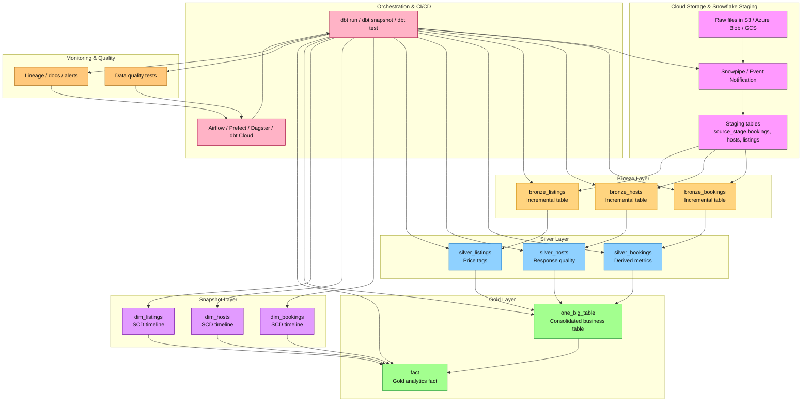

# Airbnb Pipeline Project

## Overview
This project contains a dbt-based data pipeline for an Airbnb-style analytics workflow. The pipeline is built on Snowflake and organizes data into bronze, silver, and gold layers, with snapshots used to persist slowly changing dimensions.

The project includes:
- `pipeline_project_dbt/`: dbt project directory
- `SNOWFLAKE SCRIPTS/`: Snowflake DDL and staging SQL scripts
- `logs/`: generated logs and run artifacts

## Repo Structure

- `pipeline_project_dbt/dbt_project.yml` - dbt project configuration
- `pipeline_project_dbt/profiles.yml` - Snowflake connection profile
- `pipeline_project_dbt/models/bronze/` - bronze-layer source ingestion models
- `pipeline_project_dbt/models/silver/` - silver-layer transformation models
- `pipeline_project_dbt/models/gold/` - gold-layer reporting models
- `pipeline_project_dbt/models/gold/ephemeral_models/` - ephemeral models used as snapshot sources
- `pipeline_project_dbt/snapshots/` - dbt snapshot definitions for dimension tables
- `pipeline_project_dbt/macros/` - reusable dbt macros
- `pipeline_project_dbt/models/sources.yml` - source configuration for staging tables
- `SNOWFLAKE SCRIPTS/ddl_scripts.sql` - table and schema DDL for Snowflake
- `SNOWFLAKE SCRIPTS/staging_scripts.sql` - staging pipeline SQL for Snowflake

## dbt Project Architecture

### Bronze Layer
Bronze models ingest raw source staging tables into Snowflake with incremental materializations:
- `bronze_bookings.sql`
- `bronze_hosts.sql`
- `bronze_listings.sql`

These models use:
- `{{ source('source_stage', '<table>') }}`
- `{{ ref('bronze_<table>') }}` in downstream layers

### Silver Layer
Silver models transform bronze data and add derived columns:
- `silver_bookings.sql`
- `silver_hosts.sql`
- `silver_listings.sql`

Key transformations:
- `silver_bookings` calculates `TOTAL_AMOUNT` with the `multiply` macro
- `silver_hosts` maps response rate to quality categories
- `silver_listings` casts price and adds a price tag dimension

### Gold Layer
Gold models build business-level analytics output:
- `one_big_table.sql` joins silver bookings, listings, and hosts into a consolidated table
- `fact.sql` joins `one_big_table` with snapshot dimension tables

### Ephemeral Models
Ephemeral models are used as upstream relation definitions for snapshots:
- `models/gold/ephemeral_models/bookings.sql`
- `models/gold/ephemeral_models/hosts.sql`
- `models/gold/ephemeral_models/listings.sql`

These models select and expose fields from `one_big_table` for snapshot relations.

### Snapshots
Snapshots persist dimension state into the gold schema. The current definitions are:
- `snapshots/dim_bookings.yml`
- `snapshots/dim_hosts.yml`
- `snapshots/dim_listings.yml`

Each snapshot is configured for:
- `database: AIRBNB`
- `schema: gold`
- `strategy: timestamp`
- a `unique_key` and an `updated_at` column

> Important: dbt snapshots are not created during `dbt run`. They must be run via `dbt snapshot` before models that depend on them.

## Macros
Reusable macros in `pipeline_project_dbt/macros/`:
- `multiply.sql` - multiplies two columns and rounds the result
- `tag.sql` - buckets a numeric column into `low`, `medium`, `high`
- `trimmer.sql` - trims and uppercases a column name string

## Snowflake Scripts
Snowflake-related scripts are located in the root `SNOWFLAKE SCRIPTS/` folder:
- `ddl_scripts.sql`
- `staging_scripts.sql`

Use these scripts to create and populate staging tables in Snowflake before running dbt.

## Setup

1. Install dbt for Snowflake.
2. Configure your local `profiles.yml` for Snowflake.
   - The repo currently includes a `pipeline_project_dbt/profiles.yml` example.
   - Replace hardcoded credentials with secure environment variables or your own profile settings.
3. Ensure the Snowflake account, role, warehouse, database, and schema are correct.

### Recommended `profiles.yml` pattern
```yaml
pipeline_project_dbt:
  outputs:
    dev:
      type: snowflake
      account: <ACCOUNT>
      user: <USER>
      password: <PASSWORD>
      role: <ROLE>
      database: <DATABASE>
      warehouse: <WAREHOUSE>
      schema: <SCHEMA>
      threads: 1
  target: dev
```

## Running the Pipeline

### 1. Validate configuration
```bash
cd pipeline_project_dbt
dbt debug
```

### 2. Run snapshots first
Snapshots are required before gold models that depend on them:
```bash
dbt snapshot --select dim_bookings dim_hosts dim_listings
```

### 3. Run models
```bash
dbt run
```

Or run a focused subset:
```bash
dbt run --select bronze+ silver+ gold+   # run all layers
```

### 4. Compile only
```bash
dbt compile --select gold.fact
```

## Common Issue
If you see an error like:
`Object 'AIRBNB.GOLD.DIM_LISTINGS' does not exist or not authorized`, then the snapshot object has not been created in Snowflake yet.

Fix by running:
```bash
dbt snapshot --select dim_listings dim_hosts dim_bookings
dbt run --select gold.fact
```

## Notes
- The project uses Snowflake as the data warehouse.
- The gold layer depends on snapshot tables in the `AIRBNB.GOLD` schema.
- Keep credential files out of source control and never commit passwords.
- File naming should be consistent between snapshot definitions and model refs.

## Recommended Improvements
- Convert snapshot sources to models if you want them built automatically by `dbt run`.
- Add tests under `pipeline_project_dbt/tests/` to enforce schema and data quality.
- Add a `README.md` inside `pipeline_project_dbt/` for dbt-specific documentation.
- Use environment variables or `profiles.yml` refactoring for secure credential management.

## End-to-End Pipeline Flow
This project is designed as a layered ELT pipeline. The flow is:

1. Raw Data Ingestion
   - Source data is loaded into Snowflake staging tables under the `source_stage` schema.
   - `SNOWFLAKE SCRIPTS/ddl_scripts.sql` and `SNOWFLAKE SCRIPTS/staging_scripts.sql` define and populate those tables.

2. Bronze Layer
   - `models/bronze/bronze_bookings.sql`, `bronze_hosts.sql`, and `bronze_listings.sql` ingest raw source rows into Snowflake bronze tables.
   - These models are materialized as incremental tables, preserving raw data and enabling repeatable loads.

3. Silver Layer
   - `models/silver/silver_bookings.sql` enriches booking rows with total amounts.
   - `models/silver/silver_hosts.sql` standardizes host names and creates a response-rate quality category.
   - `models/silver/silver_listings.sql` casts pricing values and computes price tags.

4. Gold Layer
   - `models/gold/one_big_table.sql` joins silver bookings, listings, and hosts into a consolidated business table.
   - `models/gold/fact.sql` joins the consolidated table with snapshot dimensions to create a fact-level analytics object.
   - Gold outputs are designed for reporting, dashboards, and analytics.

5. Snapshot Layer
   - `snapshots/dim_bookings.yml`, `snapshots/dim_hosts.yml`, and `snapshots/dim_listings.yml` capture slowly changing dimension state.
   - Snapshots are persisted into the `AIRBNB.GOLD` schema and are consumed by the gold layer.

6. Consumption & Validation
   - Downstream consumers can query the gold fact table and gold dimensions for analytics.
   - Validation is performed by dbt compile/run and by adding dedicated tests to model behavior.

## Pipeline Architecture Diagram


## Future Work
This project will continue evolving into a fully automated Airbnb analytics pipeline.

### 1. Auto-ingest new files with Snowpipe and event notification
- We will use Snowpipe to continuously ingest files from cloud storage into Snowflake staging tables.
- We will configure Snowflake event notifications on file arrival in Amazon S3, Azure Blob Storage, or Google Cloud Storage.
- Snowpipe will trigger automatically when new data files land, minimizing manual load steps.
- The staging layer will stay up to date with near real-time ingestion.

### 2. Orchestration
- We will orchestrate the pipeline using tools such as dbt Cloud, Airflow, Prefect, Dagster, or Azure Data Factory.
- The pipeline DAG will run in order:
  1. file ingestion via Snowpipe
  2. bronze model refresh
  3. silver transformations
  4. snapshot refresh
  5. gold model build
  6. tests and documentation generation
- We will add dependency-aware schedules and failure notifications.

### 3. Complex model tests and data quality
- We will implement schema tests in `pipeline_project_dbt/tests/` for unique keys, not null values, accepted values, and relationships.
- We will add data tests for business logic, such as verifying `TOTAL_AMOUNT` equals `NIGHTS_BOOKED * BOOKING_AMOUNT`.
- We will add snapshot tests for slowly changing dimensions.
- We will introduce severity-based validations and custom SQL tests for data completeness, freshness, and referential integrity.

### 4. Data observability and monitoring
- We will monitor row counts, new record volume, and incremental load health.
- We will add dbt-expectations or similar tooling to validate data quality automatically.
- We will configure alerts for schema drift, null-rate spikes, and failing pipelines.

### 5. CI/CD and deployment
- We will implement GitHub Actions or another CI pipeline to run `dbt parse`, `dbt test`, and `dbt build` on each PR.
- We will include deployment automation for production and staging Snowflake environments.
- We will validate model compilation and snapshot refreshes before merging changes.

### 6. Metadata and documentation
- We will add dbt documentation with `dbt docs generate` and `dbt docs serve`.
- We will maintain a model catalog, description metadata, and column-level documentation.
- We will document expected data freshness, source ownership, and use cases for each layer.

### 7. Architecture improvements
- We will convert gold snapshot dependencies into models if the gold layer should be fully materialized by `dbt run`.
- We will add a separate `models/gold/dimensions/` folder for dimension models and a `models/gold/facts/` folder for fact tables.
- We will add modular macros and packages for reusable transformation logic across layers.

### 8. Security and governance
- We will implement role-based access controls in Snowflake for staging, bronze, silver, and gold schemas.
